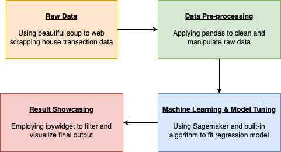

# Prediction for Housing Prices of Beijing by Using AutoML Pipeline

### Introduction

Welcome to the Beijing housing prices prediction project built by Charlie Xie and Tommy Tseng! In the interest of intergating what we have learned in this semester (2020 Fall), we decided to make use of AWS sagemaker to run a machine learning prediction analysis on a web-scrapped data. Major skillsets applied in this project were AWS sagemaker, AWS S3 Bucket, Pandas, and ipywidgets. 

To obtain the raw data for price prediction, the beautfiulsoup package was used to scrap Beijing's housing transaction records from the web. Raw data were cleaned and manipulated using pandas, and were later split into testing and training set for machine learning purpose. Linear regression modeling method from XGB was applied to fit a model on the training data set. The trained model was later tuned using hyperparameter tuning in Sagemaker to maximize prediction performance. Finally, ipywidgets were used to visualize filtered housing price and to plot kernel density estimate,also web service was deployed by using AWS elastic Beanstalk.

### Setup instruction

Step 1: Set up a notebook instance on AWS sagemaker

Step 2: Go to jupyter lab and clone the repo (https://github.com/TommyTseng1129/706-Final-Project.git)

Step 3: Execute "Running_Model_Final"

Step 4: Play around with the final outputs using ipywidgets!!

### Flow Diagram 

